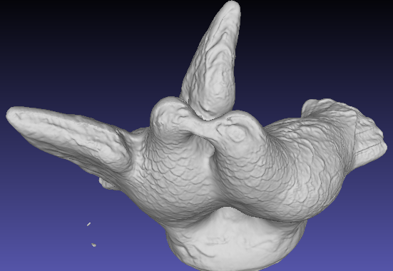
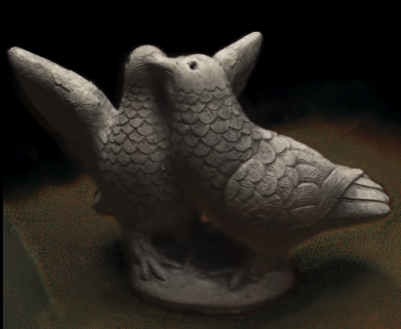

# NeuSacc

An accelerated version of the SDF-based NeuS method for surface modeling, which can accurately render novel views and reconstruct the surface of 3D solid objects based on a sparse set of views.

<p float="left">
  
   
</p>

## Features

This implementation is mainly based on a few recent advances in neural rendering:

* The original [NeuS implementation](https://github.com/Totoro97/NeuS/tree/main).

* The Hash Grid encoding from [Instant-NGP](https://nvlabs.github.io/instant-ngp/), which has been shown to vastly reduce fitting times.

* The CUDA-accelerated, fully fused MLPs and hash grid from [tinycudann](https://github.com/NVlabs/tiny-cuda-nn).

* The CUDA-accelerated rendering and occupancy grid from [Nerfacc](https://github.com/KAIR-BAIR/nerfacc).


Other interesting repositories and implementations are:

* [instant-nsr-pl](https://github.com/bennyguo/instant-nsr-pl): another accelerated implementation of NeuS with Pytorch Lightning. Very, very neat.

* [Instant-NSR](https://github.com/zhaofuq/Instant-NSR): NeuS implementation using multiresolution hash encoding.


## Running

The config in `confs/wmask_DTUscan.conf` is ready for scene 106 of the DTU scan dataset (which you can download [here](https://drive.google.com/drive/folders/1Nlzejs4mfPuJYORLbDEUDWlc9IZIbU0C)). You can reconstruct this scene in about __30 minutes__, while the original NeuS implementation takes around __2 hours__.

To fit a NeuS model on this scene, run

```
python exp_runner.py --mode train --conf ./confs/wmask_DTUscan.conf
```

You may need to slightly adjust the learning rate, the weight decay, as well as the size of the hash grid and MLPs, based on the amount of detail in each particular scene. In general, simpler, less detailed scenes will take an even shorter time, while objects containing more high frequency textures may take a bit longer to train.


## Environments and Requirements

Clone this repository
```
git clone git@github.com:alvaro-budria/NeuSacc.git
```

then either
```
conda env create -f environment.yaml
```
or
```
pip install -r requirements
```

A GPU device having a compute capability of 75 (e.g. RTX 2080Ti) or higher is needed for running the `tinycudann` MLPs and hash grid encoding. To maximally exploit the efficiency of the hash grid encoding, an A10 or an RTX3090 are recommended, as they have bigger cache sizes.


## Modelling a scene with custom COLMAP data

Please refer to [this tutorial](https://github.com/Totoro97/NeuS/tree/main/preprocess_custom_data) in the original NeuS repository for using custom data with COLMAP-generated camera poses.


## TODO

- [ ] Allow for multi-GPU training.
- [ ] Include an additional component for modelling the background, as in Mip-NeRF360 or NeRF++.
- [ ] Thoroughly benchmark this implementation of NeuS in terms of PSNR, Chamfer distance, and training time, comparing it with the original one.
- [ ] Explore the effect that the number of frequency bands and size of the hash grid and MLPs have on the outcome reconstruction.
